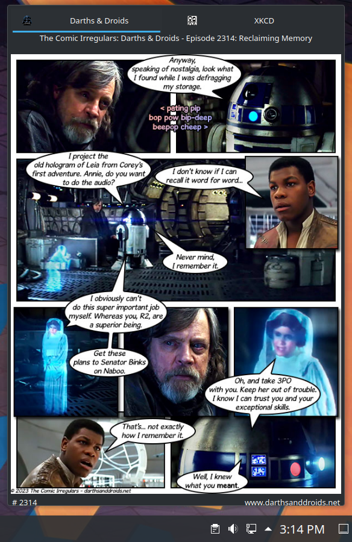

# Darths &amp; Droids Plasma Comic Plugin


Designed for the **Comic Strip** viewer in [KDE](https://kde.org "KDE Community Home") Plasma desktop.



## Direct Installation from Source (KDE Plasma Users Only)

### Required Dependencies

1. GNU `make` utility or equivalent
2. Zip utility

### Direct Installation Process

1. Run `make install` from the root of the source code
2. Open the Comic Strip application on your desktop
3. Right-click within the application and select the _Configure Comic Strip..._ menu item
4. Select the _General_ tab if needed (it should be the default location)
5. Check the *Darths &amp; Droids* box that should now appear as an option in the _Comics_ selection
6. Click _OK_ and the comic should now be viewable as a tab within the application

## Testing on Mac OS

With Docker you may test (to some extent) the plugin on Mac OS.

### Install Dependencies

1. GNU `make` utility or equivalent
2. [Docker Desktop](https://www.docker.com/products/docker-desktop)
3. [XQuartz](https://www.xquartz.org)
5. Use [Homebrew](https://brew.sh) to install SOcket CAT multipurpose relay: `brew install socat`

### Run within a Docker Image

```
make docker
```

The above script opens the KDE Comic Strip viewer in a minimalist session.
Via X11 forwarding you should be able to see the application presented within your Mac desktop.
Now you must **activate** the comic, starting with step **3** of the [direct installation](#direct-installation-process) above.

> The above command intentionally creates a **temporary** image without any saved state.
> This is ideal for active development, with frequent source changes.

In the minimalist environment you will not have full access to all the features of the Comic Strip viewer.
The `~/.xsession-errors` file is not populated without a full X Session.
You will want to load KDE on a Linux VM if you need robust debugging.

For some level of debug within Docker you can set `ENABLE_DEBUG = true` in [main.js](src/contents/code/main.js#L31).
Doing so will prefix some log statements to the Alt text that appears over the comic images.
A limited amount of text may be visible on hover;
you can view more via the `.conf` files cached in the `~/.local/share/plasma_engine_comic` directory.
